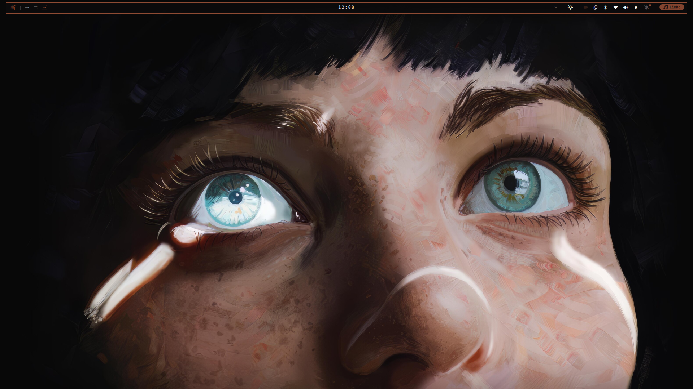
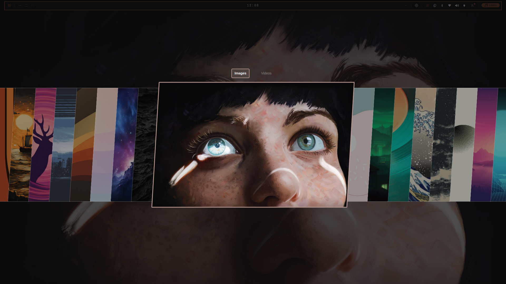
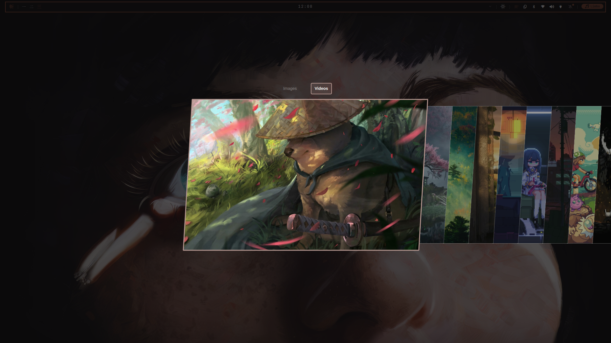
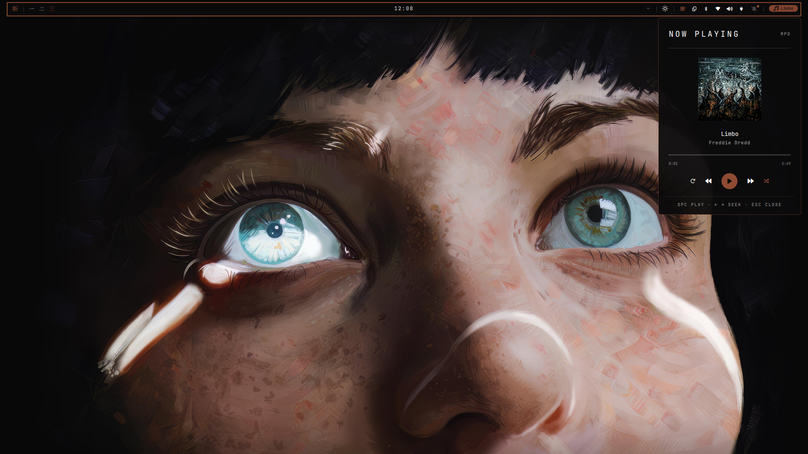
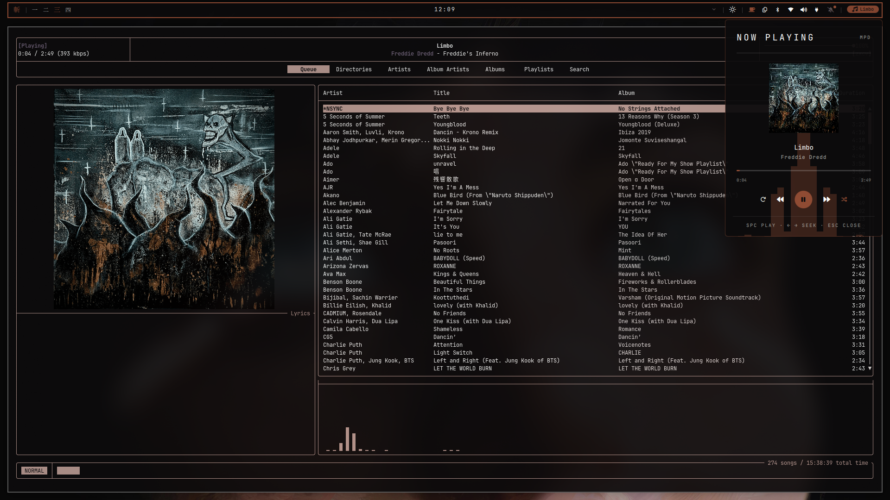
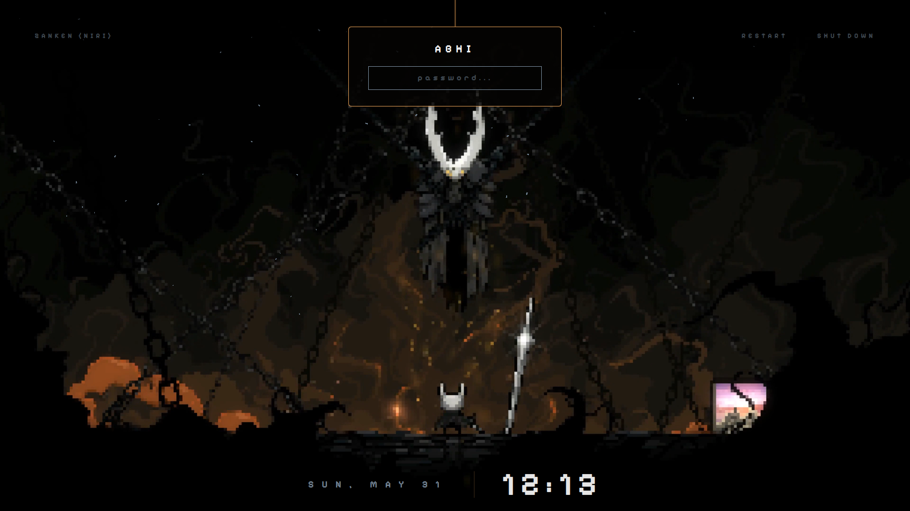
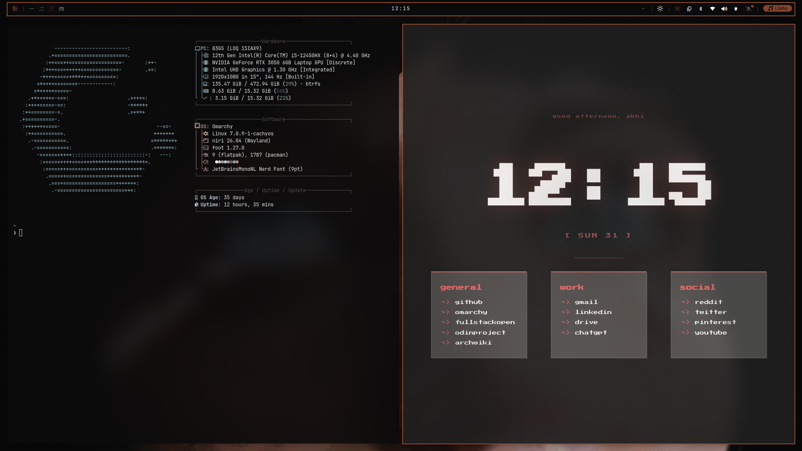

# Zanken

A Niri-based Linux workspace derived from [Omarchy](https://github.com/basecamp/omarchy).

## Screenshots

| | |
|---|---|
|  |  |
| Desktop with Quickshell bar | Wallpaper picker |
|  |  |
| Wallpaper selection | Now Playing popup |
|  |  |
| rmpc music player | Lock screen (qylock) |
|  | |
| Quickshell dashboard | |

Replaces Hyprland with the [Niri](https://github.com/YaLTeR/niri) scrolling compositor and Waybar with [Quickshell](https://quickshell.outfoxxed.me/), while keeping Omarchy's 300+ script layer intact.

## Install

```bash
bash <(curl -fsSL https://raw.githubusercontent.com/selfAnnihilator/dotfiles/main/install.sh) --clean
```

## What's included

- **[Niri](https://github.com/YaLTeR/niri)** — scrolling tiling Wayland compositor
- **[Quickshell](https://quickshell.outfoxxed.me/)** — QML bar with audio, wifi, bluetooth, music, weather popups
- **308 scripts** — `zanken-*` commands for everything from themes to hardware detection
- **21 built-in themes** — tokyo-night, catppuccin, kanagawa, gruvbox, nord, and more
- **Dynamic wallpaper colors** — palette extracted from wallpaper via zanken-wallpaper-colors

## Documentation

**[selfAnnihilator.github.io/zanken](https://selfAnnihilator.github.io/zanken)**

- [Installation](https://selfAnnihilator.github.io/zanken/installation)
- [Keybinds](https://selfAnnihilator.github.io/zanken/keybinds)
- [Themes](https://selfAnnihilator.github.io/zanken/themes)
- [Commands](https://selfAnnihilator.github.io/zanken/commands)
- [Configuration](https://selfAnnihilator.github.io/zanken/configuration)

## Quick reference

```bash
zanken-theme-set tokyo-night    # switch theme
zanken-theme-bg-set wall.jpg    # set wallpaper + extract palette
zanken-audio-input-mute         # toggle microphone
zanken-capture-screenshot       # take screenshot
zanken-default-terminal kitty   # change default terminal
```

## Structure

```
zanken/
├── bin/          # 308 zanken-* scripts (on $PATH)
├── config/       # Base configs
├── default/      # Default app configs
├── themes/       # 21 built-in color themes
├── install/      # Install phase scripts
└── migrations/   # Version migration scripts
```

## Credits

Quickshell bar and popups derived from [bjarneo/quickshell](https://github.com/bjarneo/quickshell).

Lock screen and SDDM theme derived from [Darkkal44/qylock](https://github.com/Darkkal44/qylock).

## Differences from Omarchy

| Feature | Omarchy | Zanken |
|---------|---------|--------|
| Compositor | Hyprland | Niri |
| Bar | Waybar | Quickshell |
| Notifications | Mako | Elephant |
| Focus model | Tiling (manual) | Scrolling columns |
| Config format | Hyprland DSL | KDL |

## License

[MIT](LICENSE)
